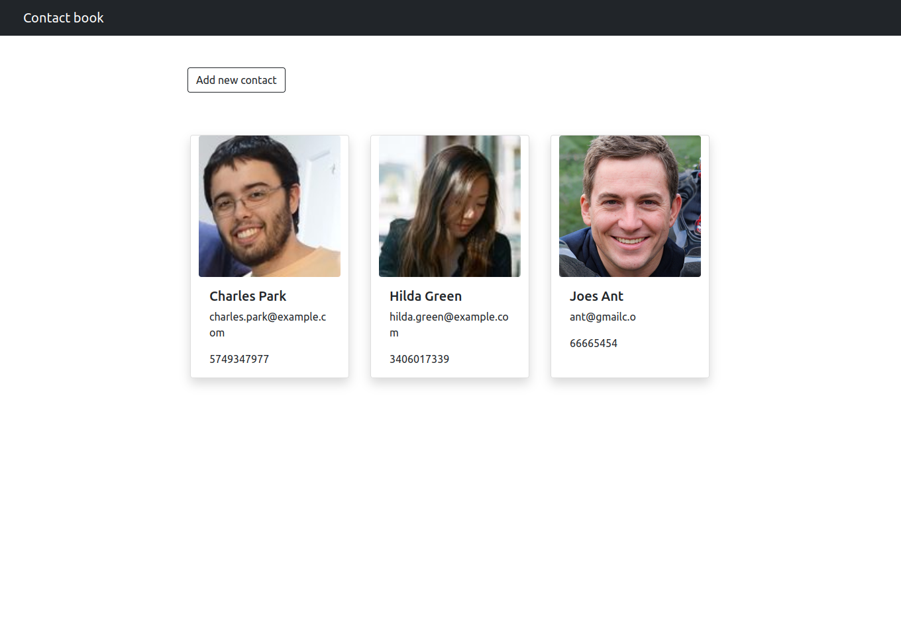

# Contact Book (server)

This repository is the server side of a contact book application that allows you to simply create a new contact, edit that contact and delete it.


## Installation

Clone this repository

```bash
  cd contact-book-server
```
On root folder install all dependencies with NPM.
```bash
  npm install
```

In the project directory, you can run:

#### `npm start`

Runs the app in the development mode.\
Open [http://localhost:${PORT}](http://localhost:3000) to view it in the browser.

The page will reload if you make edits.\
You will also see any lint errors in the console.
## Environment Variables

To run this project, you will need to add the following environment variables to your .env file

`PORT`e.g. : PORT=3000

`MONGODB_URI` e.g. : MONGODB_URI='mongodb://localhost:27017'


## Screenshots




## Tech Stack

**Client:** React, Redux, Bootstrap

**Server:** Node, Express, Mongoose

